# 聆森 Listen ｜ 官方網頁素材與圖庫公開倉庫

本倉庫收錄「聆森 Listen」官方網站、聆聽者培力計畫專案網頁、課程活動與品牌識別所使用之所有核心圖片素材。提供設計協作、宣傳推廣與合作夥伴參考引用。

---

## 快速打包下載

若您需要一次取得全套素材，可直接點擊下方連結下載完整壓縮包：

* **全套圖庫壓縮包下載（ZIP・約 18.9 MB）**：[點此直接下載 聆森官方圖庫素材包.zip](https://github.com/alananaone/listenfy-image/raw/main/%E8%81%86%E6%A3%AE%E5%AE%98%E6%96%B9%E5%9C%96%E5%BA%AB%E7%B4%A0%E6%9D%90%E5%8C%85.zip)

---

## 目錄結構與預覽索引

本圖庫依使用場景劃分為六大分類：

1. **01 品牌識別與標誌**（Logo、標準字與呼吸意象向量圖）
2. **02 培力特色亮點**（四大核心亮點展示圖）
3. **03 八週課程主圖**（培力計畫八週核心課堂卡片圖）
4. **04 專業心理師陣容**（師資顧問個人相片）
5. **05 活動現場與情境**（Coffee & Chat 咖啡陪伴與實體演練情境相片）
6. **06 高畫質原始相片**（相機原始解析度大圖）

---

### 一、品牌識別與標誌

| 預覽 | 檔案名稱 | 說明 | 原始檔案連結 |
| :---: | :--- | :--- | :--- |
| 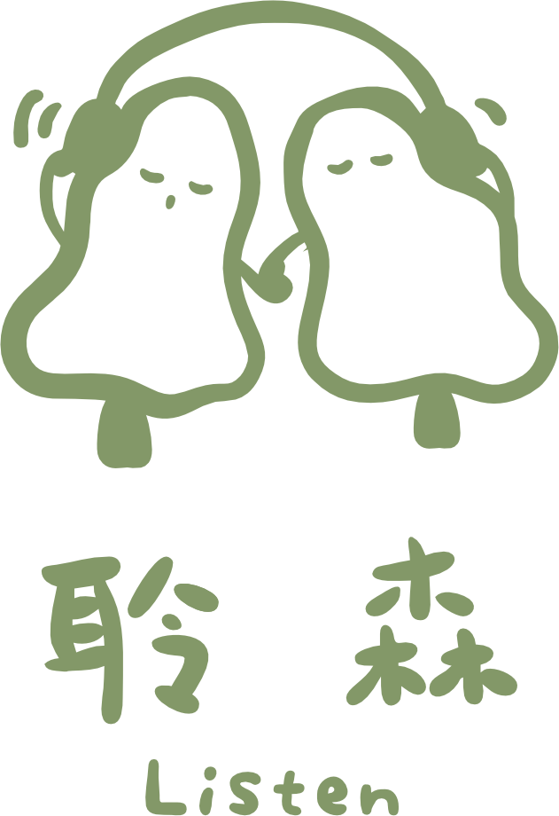 | 聆森橫式標誌-主色.png | 官方標準深綠色橫式 Logo，適用於淺色底 | [檢視原檔](01_品牌識別與標誌/聆森橫式標誌-主色.png) |
|  | 聆森橫式標誌-白色.png | 官方純白色橫式 Logo，適用於深色底與簡報 | [檢視原檔](01_品牌識別與標誌/聆森橫式標誌-白色.png) |
| 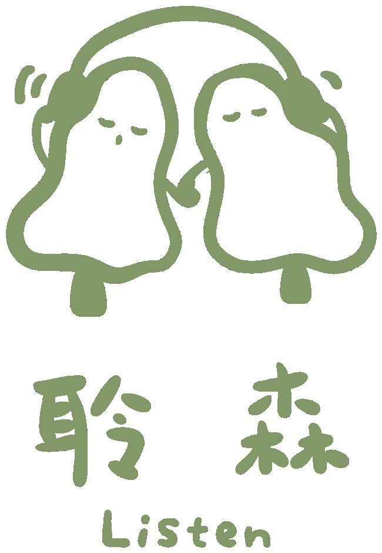 | 聆森品牌標誌.png | 品牌方型徽章標誌，適用於頭貼與圖標 | [檢視原檔](01_品牌識別與標誌/聆森品牌標誌.png) |
|  | 聆森呼吸核心圖標.png | 呼吸同頻幾何核心視覺圖標（PNG 格式） | [檢視原檔](01_品牌識別與標誌/聆森呼吸核心圖標.png) |
|  | 聆森呼吸核心圖標.svg | 呼吸同頻幾何核心視覺圖標（SVG 向量格式） | [檢視原檔](01_品牌識別與標誌/聆森呼吸核心圖標.svg) |

---

### 二、培力計畫特色亮點

| 預覽 | 檔案名稱 | 說明 | 原始檔案連結 |
| :---: | :--- | :--- | :--- |
| 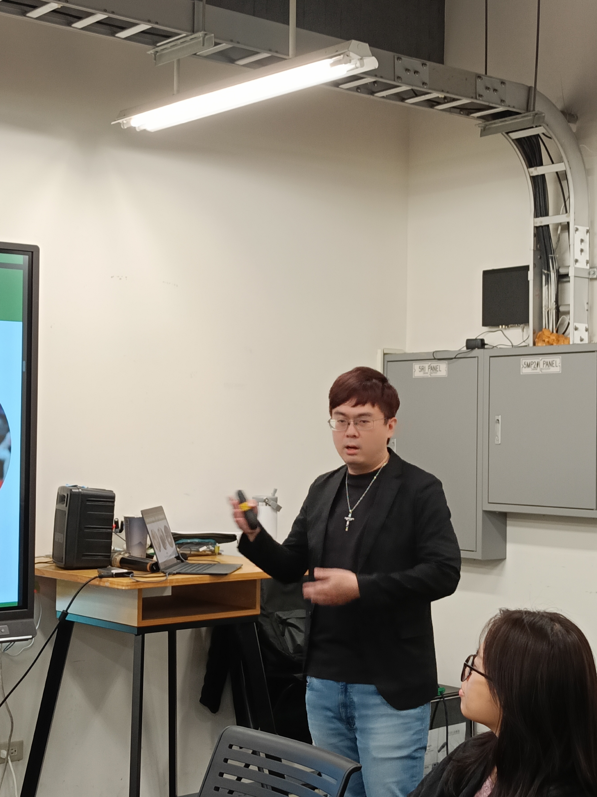 | 特色01_心理師親授與陪伴.jpg | 專業臨床與諮商心理師實務親授指導 | [檢視原檔](02_培力特色亮點/特色01_心理師親授與陪伴.jpg) |
| 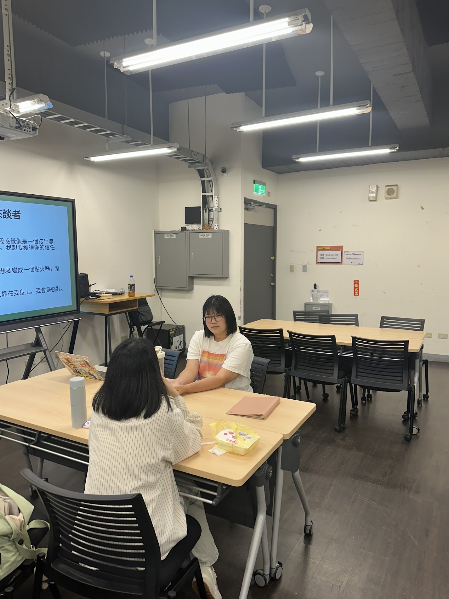 | 特色02_實務演練與分組.jpg | 實體工作坊分組演練與情境引導 | [檢視原檔](02_培力特色亮點/特色02_實務演練與分組.jpg) |
| 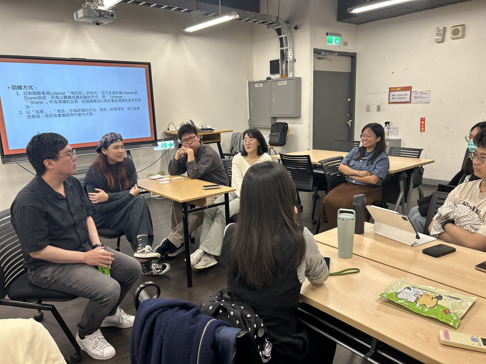 | 特色03_社群支持與咖啡對話.jpg | 咖啡對話情境與溫暖同儕陪伴支持 | [檢視原檔](02_培力特色亮點/特色03_社群支持與咖啡對話.jpg) |
|  | 特色04_認證結業與證書.jpg | 結業正式頒發官方培力認證證書 | [檢視原檔](02_培力特色亮點/特色04_認證結業與證書.jpg) |

---

### 三、培力八週課程主圖

| 預覽 | 檔案名稱 | 週次主題 | 原始檔案連結 |
| :---: | :--- | :--- | :--- |
|  | 第一週_專注進入臨在.jpg | 第一週：專注進入臨在與敏銳度練習 | [檢視原檔](03_八週課程主圖/第一週_專注進入臨在.jpg) |
| 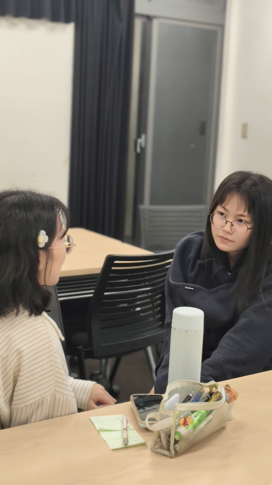 | 第二週_七大積極傾聽.jpg | 第二週：七大積極傾聽與刻意練習 | [檢視原檔](03_八週課程主圖/第二週_七大積極傾聽.jpg) |
| 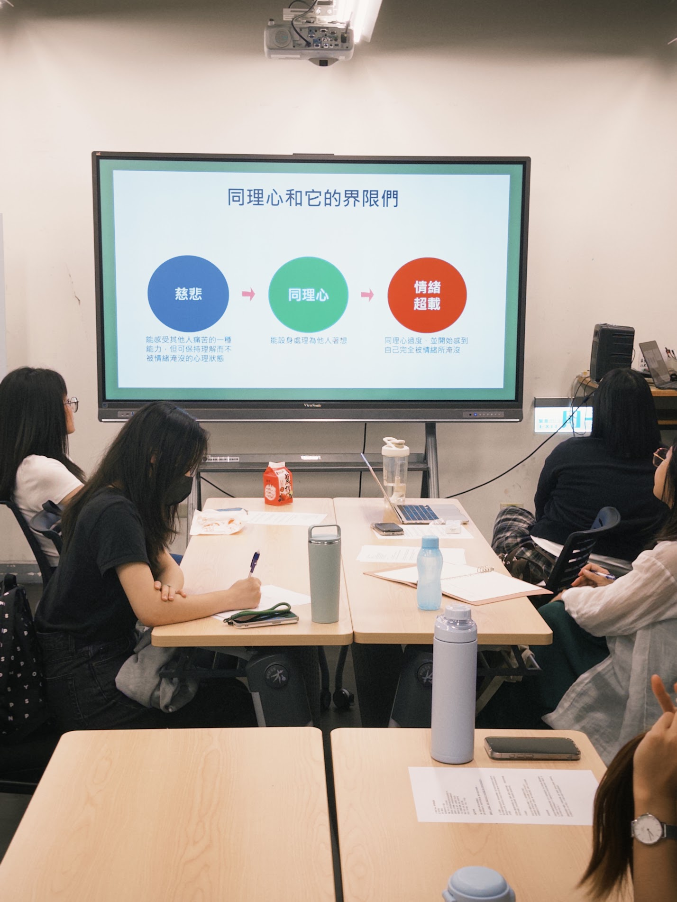 | 第三週_同理情感反映.jpg | 第三週：同理四大特性與情感反映 | [檢視原檔](03_八週課程主圖/第三週_同理情感反映.jpg) |
|  | 第四週_艾瑞克森引導.jpg | 第四週：艾瑞克森鑽石模式與平行故事引導 | [檢視原檔](03_八週課程主圖/第四週_艾瑞克森引導.jpg) |
| 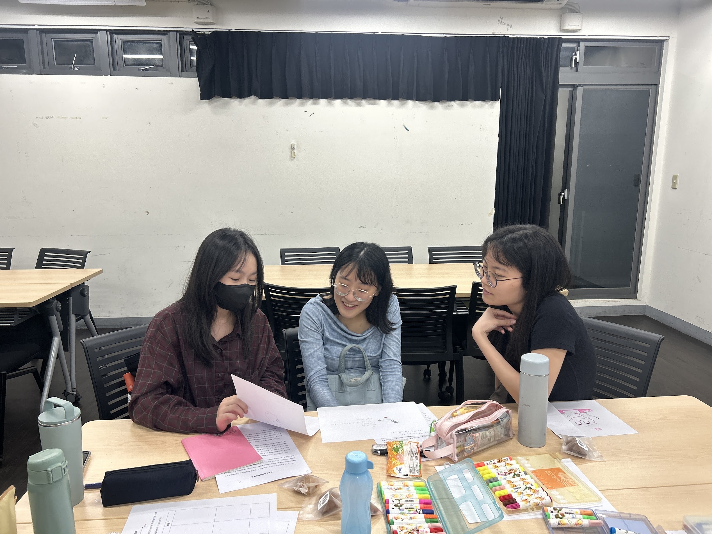 | 第五週_關係公式守護.jpg | 第五週：關係公式建立與邊界守護 | [檢視原檔](03_八週課程主圖/第五週_關係公式守護.jpg) |
| 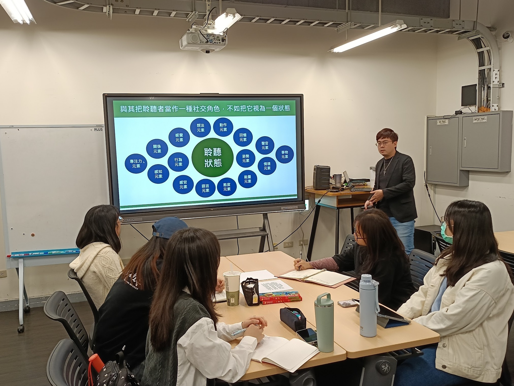 | 第六週_理想聆森狀態.jpg | 第六週：理想聆森狀態與另我效應 | [檢視原檔](03_八週課程主圖/第六週_理想聆森狀態.jpg) |
| 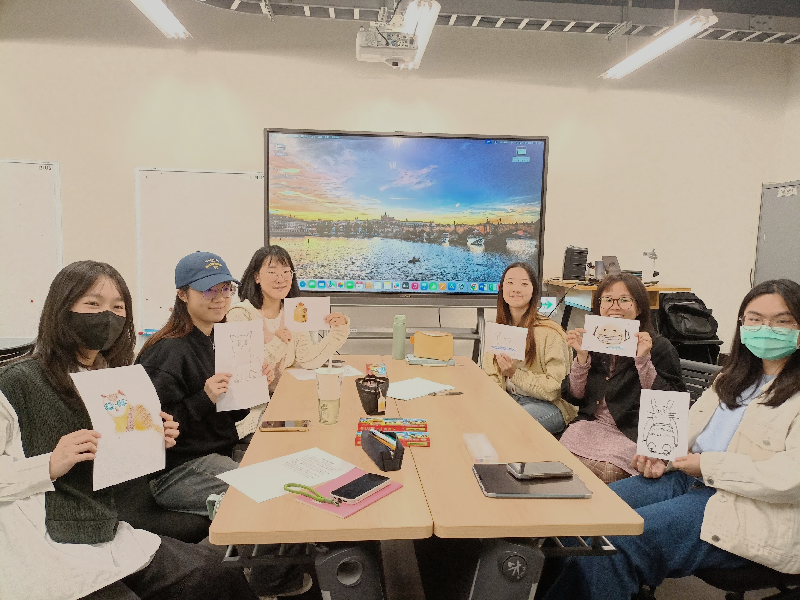 | 第七週_Chakra放鬆.jpg | 第七週：Chakra 放鬆與情緒擬人化 | [檢視原檔](03_八週課程主圖/第七週_Chakra放鬆.jpg) |
| 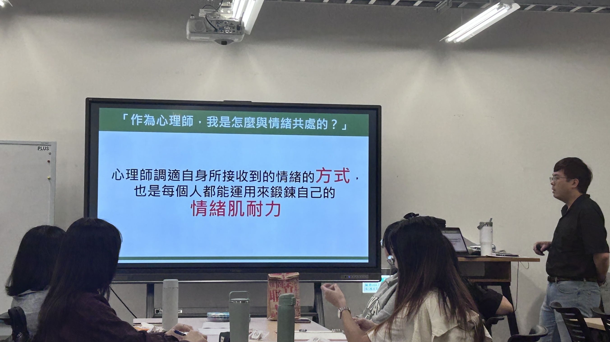 | 第八週_自我慈悲鍛鍊.jpg | 第八週：情緒肌群鍛鍊與自我慈悲 | [檢視原檔](03_八週課程主圖/第八週_自我慈悲鍛鍊.jpg) |

---

### 四、專業心理師師資陣容

| 預覽 | 檔案名稱 | 心理師姓名與頭銜 | 原始檔案連結 |
| :---: | :--- | :--- | :--- |
|  | 李炯德_臨床心理師.jpg | 李炯德 臨床心理師 | [檢視原檔](04_專業心理師陣容/李炯德_臨床心理師.jpg) |
|  | 梁韶庭_諮商心理師.jpg | 梁韶庭 諮商心理師 | [檢視原檔](04_專業心理師陣容/梁韶庭_諮商心理師.jpg) |
|  | 畢佳恩_諮商心理師.jpg | 畢佳恩 諮商心理師 | [檢視原檔](04_專業心理師陣容/畢佳恩_諮商心理師.jpg) |
|  | 施亮竹_諮商心理師.jpg | 施亮竹 Maggie 諮商心理師 | [檢視原檔](04_專業心理師陣容/施亮竹_諮商心理師.jpg) |

---

### 五、活動現場與情境

| 預覽 | 檔案名稱 | 說明 | 原始檔案連結 |
| :---: | :--- | :--- | :--- |
|  | Coffee_and_Chat現場陪伴主圖.webp | 咖啡對話現場氛圍與陪伴形象圖 | [檢視原檔](05_活動現場與情境/Coffee_and_Chat現場陪伴主圖.webp) |
| 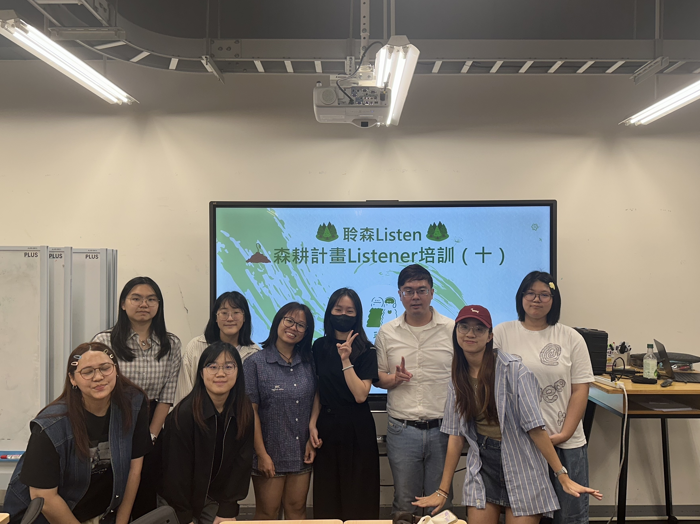 | 培力實體工作坊主圖.jpg | 培力實體工作坊現場大圖 | [檢視原檔](05_活動現場與情境/培力實體工作坊主圖.jpg) |
| 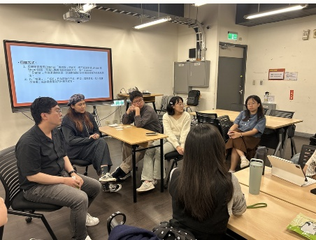 | 傾聽實務演練_情境1.jpg | 傾聽行動現場演練實況 1 | [檢視原檔](05_活動現場與情境/傾聽實務演練_情境1.jpg) |
|  | 咖啡廳深度傾聽_情境2.jpg | 咖啡廳深度對談實況 2 | [檢視原檔](05_活動現場與情境/咖啡廳深度傾聽_情境2.jpg) |
|  | 街頭溫暖陪伴_情境3.jpg | 街頭陪伴與傾聽行動實況 3 | [檢視原檔](05_活動現場與情境/街頭溫暖陪伴_情境3.jpg) |

---

### 六、高畫質原始相片

| 檔案名稱 | 說明 | 原始檔案連結 |
| :--- | :--- | :--- |
| 特色1_心理師親授原始大圖.jpg | 相機直出原始檔（3.1 MB） | [檢視原檔](06_高畫質原始相片/特色1_心理師親授原始大圖.jpg) |
| 特色2_課堂演練原始大圖.jpg | 相機直出原始檔（753 KB） | [檢視原檔](06_高畫質原始相片/特色2_課堂演練原始大圖.jpg) |
| 特色3_陪伴對話原始大圖.jpg | 相機直出原始檔（925 KB） | [檢視原檔](06_高畫質原始相片/特色3_陪伴對話原始大圖.jpg) |
| 特色4_頒發證書原始大圖.jpg | 相機直出原始檔（1.8 MB） | [檢視原檔](06_高畫質原始相片/特色4_頒發證書原始大圖.jpg) |

---

## 授權與宣告

* 本專案圖片素材版權屬國立臺灣大學「聆森 Listen」團隊與原作者所有。
* 僅供計畫推廣、學術交流與合作洽詢參考使用，未經授權請勿逕自轉作非授權之商業用途。
